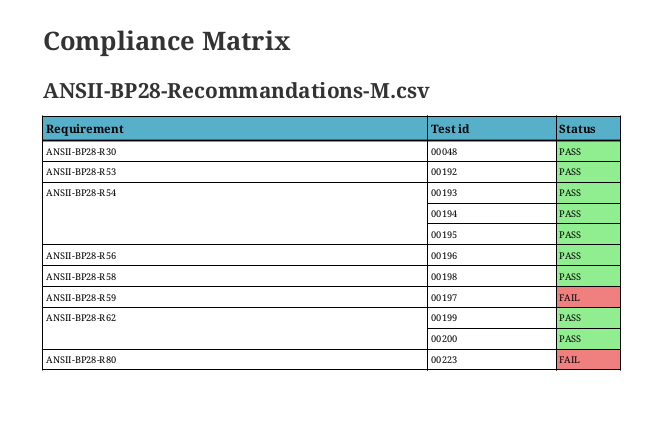

# Test report PDF

The goal of this tool is to generate asciidoc pdf which includes Junit .xml test
results.
This tool is intended to parse cukinia generated Junit files.

## Usage

 $ ./compile.py -h

A docker support is provided using [cqfd](https://github.com/savoirfairelinux/cqfd).
When building directly on the machine, asciidoctor-pdf and junitparser python package are required.

## Features

Xml files are automatically detected and displayed in the test report. Each file creates its own table with all tests one after another.
Several tables can be generated for the same file using cukinia suite feature : `logging suite "name"` in the cukinia configuration file. This will also change the title of the table.

To specify the table title for a machine, use the class feature of cukinia : `logging class "name"` and the `-m` option. This will append "for name" in the title.

The source directory can be selected with the `-i` option. This directory shall contain all xml file to include to the test report.
It can also include a `prerequisites.adoc` file that will be added on top of the document and a `notes.adoc` file that will appear at the end. Both files are optional.


## Compliance matrix

One or many compliance matrices can be added at the end of the report. These matrices are auto-generated by the program, using a csv file in entry.

The csv must contain on each line a requirement and a test id.
Here is an example :

```
cluster requirement,289
security requirement,143
security requirement,17
security requirement,23
stress resistance,34
stress resistance,35
documentation requirement,345
```
This csv file will be sorted alphabetically before being integrated in the document.

When the `-m` option is set, the matrix is created for each machines used in the xml.
When the option is not set, only one matrix is provided, compiling the result of all machines at once.

This feature only works when the tests provide an ID field.



## Examples

Two examples are provided in the `examples` directory, both with their original cukinia.conf file.
Lauching the `cqfd` command without any argument will compile these two examples.
